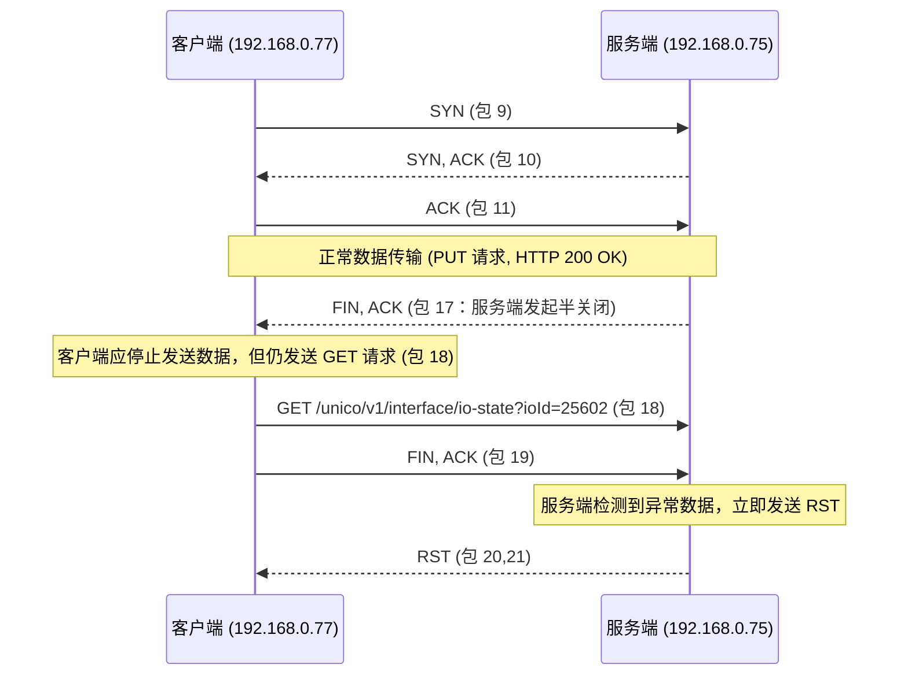

# HTTP 请求触发 RST 排查

# 问题描述
  通过 dio 实现 HTTP 完成下位机控制功能的场景中，发现对某个接口短时间连续发送请求控制指令无法生效，进行抓包排查发现存在 RST 报文；

## 问题报文

在抓包中，我们注意到关键包如下（简化描述）：

包 17（0.029042秒）：

服务器（192.168.0.75）向客户端（192.168.0.77）发送 FIN, ACK，表示服务器关闭了连接的一半。

包 18（0.029142秒）：

客户端发送 HTTP GET 请求（GET /unico/v1/interface/io-state?...），试图利用同一连接发送新的请求。

包 19（0.029501秒）：

客户端发送 FIN, ACK 表示自己也关闭连接的一半。

包 20 和 21（0.030542秒、0.030838秒）：

服务器发送 RST 包，重置连接。

可能原因：

连接复用问题：服务器在包 17 中已经关闭了写端（发送 FIN），表示不再接收新数据。如果客户端在此后尝试在同一连接上发送 GET 请求，就会违反 TCP 协议，导致服务器直接回复 RST 来拒绝数据。

协议状态错误：客户端可能没有正确检测到服务器已经关闭连接，依然使用了该连接，从而引发 RST。

资源清理问题：客户端如果没有正确管理连接的生命周期，也可能导致误用已经关闭的连接。

### **排查步骤：**

1. **抓包确认：**
    使用 Wireshark 检查客户端是否在收到 FIN 后仍然发送 GET 请求。确认包 17 的 FIN 是否正确到达客户端，以及包 18 的 GET 是否在此之后发送。
2. **检查连接管理：**
    在客户端代码中，确认网络库或 HTTP 客户端是否正确处理了服务器的 FIN 消息。检查是否存在重用已关闭连接的情况。
3. **日志调试：**
    在客户端增加详细日志，记录每次连接状态变化和发送请求前的连接状态。

### **优化方案：**

1. **不复用已关闭连接：**
    当客户端接收到服务器 FIN 后，应将当前连接标记为关闭，并在下一次请求时新建连接。可以在 HTTP 客户端中设置 “Connection: close” 头部，或使用内置的重连机制。
2. **改进连接状态检测：**
    检查 TCP 状态，如果检测到连接已被半关闭，则不再继续发送数据，而是重新建立连接。
3. **在客户端网络库中增加容错逻辑：**
    当收到 RST 时，自动重建连接并重试请求，确保不会因为单次错误导致整个业务流程中断

## **1. 深度分析**

根据抓包数据，关键步骤如下：

1. **连接建立与数据传输：**
   - 包 9-11：TCP 三次握手成功建立连接。
   - 包 12-16：客户端发送 PUT 请求，服务端返回 HTTP 200 OK。
2. **服务端发起断开：**
   - 包 17：服务端发送 FIN, ACK（Seq=112, Ack=317），表示服务端主动关闭写方向，开始半关闭连接。
3. **客户端异常行为：**
   - 包 18：客户端在收到 FIN 后，依然发送新的 GET 请求（GET /unico/v1/interface/io-state?ioId=25602）。
   - 包 19：客户端再发送 FIN, ACK，试图关闭自己的发送端。
4. **服务端的响应：**
   - 包 20-21：服务端收到在已半关闭连接上收到数据后，立即发送 RST（重置）报文，拒绝非法数据。

### **问题所在**

- **协议违例：** TCP 协议规定，当一方发送 FIN 后，该方向对方表示不再发送数据。如果客户端在接收到 FIN 后继续发送数据（如 GET 请求），则会违反协议，导致对方直接回复 RST，重置连接。
- **客户端处理问题：** 客户端未能正确检测到连接已进入半关闭状态（收到 FIN），仍然复用该连接发送新的请求，最终引发服务端 RST。
- 引发原因：
  - 客户端可能没有在网络库中对 FIN 信号做出正确反应。
  - 或者存在连接复用逻辑错误，导致错误地继续使用已经关闭的连接。

------

## **2. Mermaid 时序图**

以下是关键节点的时序图，展示了 TCP 断开与重置过程：

------

## **3. 优化建议**

### **客户端优化**

1. **正确处理 FIN 信号：**
   - 当客户端接收到 FIN 时，应将连接标记为半关闭状态，不再发送数据，而是新建连接进行后续请求。
   - 在使用 HTTP 客户端库时，确保其内部状态管理能检测到连接终止（如检查 TCP 状态或 HTTP 错误）。
2. **连接复用策略：**
   - 在发送新请求前，检查现有连接的状态，避免重用已关闭的连接。
   - 如果检测到连接已关闭，则自动重建新连接。
3. **错误处理与重试机制：**
   - 在收到 RST 或其他网络错误时，主动触发重连或请求重发，保证用户体验。

### **服务端优化**

1. 日志与监控：
   - 在服务端记录 RST 事件和连接异常情况，以便及时发现客户端重用已关闭连接的情况。
2. 连接管理：
   - 虽然服务端在收到 FIN 后的标准行为是发送 RST，但可以考虑：
     - 在检测到不合法的数据包时，返回适当的 HTTP 错误代码（如 400 Bad Request），而不是立即重置连接，但这通常会违背 TCP 的严格协议规定。
   - 最好的办法还是**在客户端做好连接状态管理**，确保服务端收到的数据都是在有效连接内的。

------

## **4. 结论**

**主要问题在于客户端未正确处理服务器发送的 FIN 信号，错误地在半关闭连接上继续发送数据，从而引发服务端返回 RST。**

**优化建议：**

- **客户端：**
  - 及时检测 FIN 信号，停止使用已关闭连接。
  - 新请求应新建连接，确保不会发送到半关闭连接。
  - 增加错误处理机制，捕获 RST 后重建连接。
- **服务端：**
  - 按照 TCP 标准发送 RST，但通过日志记录帮助发现客户端异常行为。

这种优化能确保连接管理正确、网络通信稳定，减少因为连接状态异常引发的重置问题，进而提升整体多端智能反馈系统的可靠性。

## 3. 优化建议

### **客户端优化**

1. **正确处理 FIN 信号**
   - **检测连接状态**：在接收到 FIN 后，应将当前连接标记为不可用，避免继续使用该连接发送新的请求。
   - **自动重建连接**：当检测到当前连接已半关闭或失效时，自动新建一个新的 TCP 连接进行后续请求。
2. **连接管理改进**
   - 在 HTTP 客户端封装中增加对 TCP 连接状态的检测，比如通过底层网络库或捕捉异常（如 RST）触发重连。
   - 如果使用诸如 Dio 或其他网络库，确保它们在出现 RST 后能自动重新建立连接。
3. **增强错误处理**
   - 对于 RST 错误，增加重试逻辑，并记录详细日志，便于快速定位问题。

### **服务端优化**

1. **记录和监控异常连接**
   - 增加日志记录，监控来自同一源端口重复请求的情况，便于分析客户端是否存在连接复用问题。
2. **连接超时策略**
   - 服务端可以设定更严格的连接超时策略，确保在收到 FIN 后尽快关闭该连接，减少异常数据包到达的可能性。
3. **返回明确错误码**
   - 虽然 TCP 标准要求在收到异常数据时发送 RST，但服务端可以结合上层 HTTP 协议，返回明确错误提示，帮助客户端及时重连。

