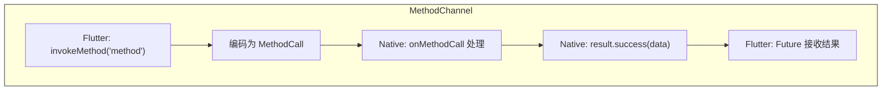
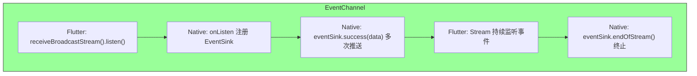
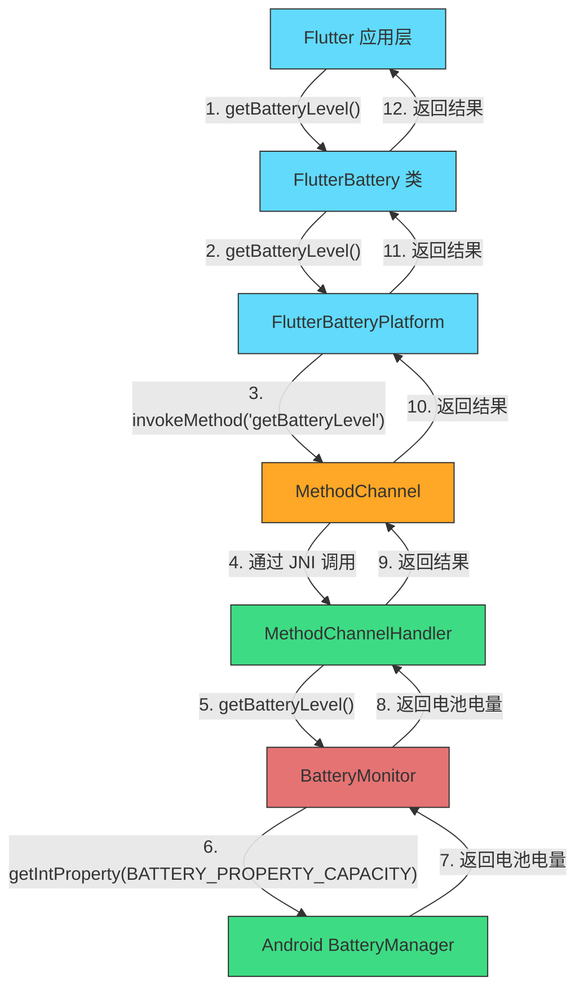
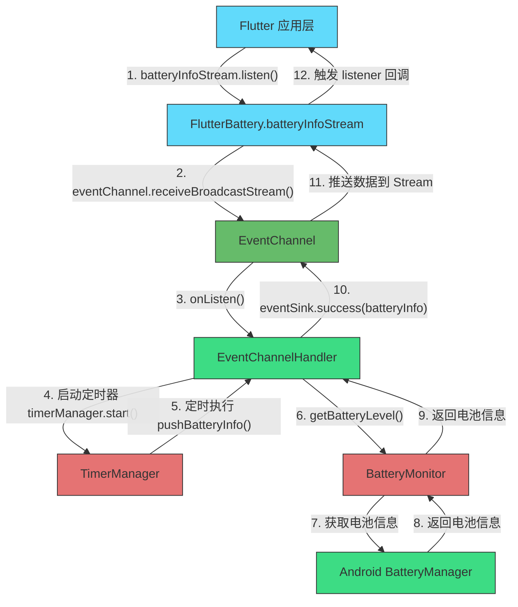
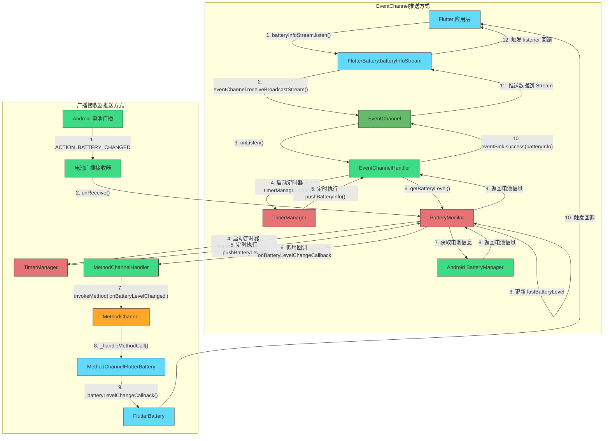

# 一、EventChannel 与 MethodChannel 差异对比

Dart 层与原生层之间既有 “点对点” 的方法调用（MethodChannel），也有 “流式推送” 的事件订阅（EventChannel）。两者在使用场景、调用方式和数据流向上存在明显差异，本文将梳理二者差异及对应适用场景。

| 特性             | MethodChannel                                | EventChannel                                       |
| ---------------- | -------------------------------------------- | -------------------------------------------------- |
| **通信模式**     | 同步／异步请求-响应                          | 单向持续推送                                       |
| **典型场景**     | 主动查询（如获取当前电量）、命令下发         | 被动监听（如电池状态变化事件）                     |
| **调用方式**     | `invokeMethod(…)` → `Future<T>`              | `receiveBroadcastStream()` → `Stream<T>`           |
| **原生实现**     | 调用 `MethodChannel.setMethodCallHandler`    | 调用 `EventChannel.setStreamHandler`               |
| **性能特点**     | 每次请求都会附带方法名和参数，适用于低频交互 | 建立一次通道后可推送大量事件，适用于高频／实时数据 |
| **错误处理**     | 通过 `PlatformException`（try/catch）捕获    | 通过 `Stream.listen(onError: …)` 处理流中错误      |
| **生命周期管理** | 每次调用独立，Dart 侧发起后即完成            | 通道打开后需手动取消订阅：`subscription.cancel()`  |

***

### 示例对比

#### 1. MethodChannel 用于一次性查询

//Flutter 层

```dart
Future<int?> getBatteryLevel() async {
  try {
    final int level = await _methodChannel.invokeMethod('getBatteryLevel');
    return level;
  } on PlatformException catch (e) {
    debugPrint('MethodChannel 错误：${e.message}');
    return null;
  }
}
```

// Android 原生

```kotlin
class FlutterBatteryPlugin : FlutterPlugin {
  override fun onMethodCall(call: MethodCall, result: MethodChannel.Result) {
    when (call.method) {
      "getBatteryLevel" -> {
        val level = batteryMonitor.currentLevel()
        result.success(level)
      }
      else -> result.notImplemented()
    }
  }
}
```

> **调用流程**：
>
> 1.  Dart 调用 `invokeMethod("getBatteryLevel")`；
> 2.  平台通道将方法名传给原生；
> 3.  原生执行并通过 `result.success(level)` 回传；
> 4.  Dart `Future` 完成并拿到值。



#### 2. EventChannel 用于持续监听

// Flutter 层

```dart
StreamSubscription<Map<String, dynamic>>? _batterySub;

void startBatteryMonitoring() {
  _batterySub = _eventChannel
    .receiveBroadcastStream()
    .cast<Map<String, dynamic>>()
    .listen(
      (data) => debugPrint('电池数据：$data'),
      onError: (e) => debugPrint('EventChannel 错误：$e'),
    );
}

void stopBatteryMonitoring() {
  _batterySub?.cancel();
}
```

// Android 原生

```kotlin
class FlutterBatteryStreamHandler : EventChannel.StreamHandler {
  private var eventSink: EventChannel.EventSink? = null

  override fun onListen(args: Any?, sink: EventChannel.EventSink) {
    eventSink = sink
    batteryMonitor.setOnBatteryLevelChangeCallback { level ->
      eventSink?.success(mapOf("batteryLevel" to level))
    }
  }

  override fun onCancel(args: Any?) {
    batteryMonitor.clearCallback()
    eventSink = null
  }
}
```

> **调用流程**：
>
> 1.  Dart 调用 `receiveBroadcastStream()` 并监听；
> 2.  原生 `onListen` 注册后向 Dart 推送事件流；
> 3.  每当电量变化，原生调用 `eventSink.success(data)`；
> 4.  Dart 的 `Stream` 收到并分发给回调。



***

# 二、使用 EventChannel 与 MethodChannel 封装实现一个电池检测插件

应用开发中，获取电池信息和监控电池状态通常需要编写原生代码并通过平台通道(Platform Channel)与Flutter 通信。下文将深入解析`flutter_battery` Android 电池检测插件，对比实现主动读取及监听推送功能对于 channel 的使用场景；


## 一、插件架构概述

`flutter_battery`插件采用了标准的Flutter插件架构，主要包含以下几个部分：

### 1. Dart层接口定义

定义平台接口(`FlutterBatteryPlatform`)，用于规范不同平台实现的API约定

```dart
abstract class FlutterBatteryPlatform extends PlatformInterface {
  // 平台通用的API定义
  Future<int?> getBatteryLevel();
  Future<Map<String, dynamic>> getBatteryInfo();
  // 更多API...
}
```

### 2. 方法通道实现

```dart
class MethodChannelFlutterBattery extends FlutterBatteryPlatform {
  final methodChannel = const MethodChannel('flutter_battery');
  final eventChannel = const EventChannel('flutter_battery/battery_stream');
  
  // 实现平台接口中定义的各种方法
}
```

#### MethodChannel



#### EventChannel





### 3. 原生实现层

在Android平台上，插件实现了完整的电池监控功能：

```kotlin
class FlutterBatteryPlugin : FlutterPlugin, ActivityAware {
  // 插件初始化和资源管理
  private lateinit var batteryMonitor: BatteryMonitor
  private lateinit var notificationHelper: NotificationHelper
  // 更多组件...
}
```

## 三、通信机制深度解析

### 1. 双向通信设计

这个插件的通信机制设计非常精巧，采用了双通道策略：

*   **MethodChannel**：用于Flutter向原生平台发送命令和请求数据
*   **EventChannel**：用于原生平台向Flutter持续推送电池状态变化事件

这种设计使得插件可以同时支持：

*   按需查询（如获取当前电量）
*   持续监听（如实时电池状态变化）

### 2. 回调机制设计

插件在Dart层定义了多种回调接口：

```dart
void configureBatteryCallbacks({
  Function(int batteryLevel)? onLowBattery,
  Function(int batteryLevel)? onBatteryLevelChange,
  Function(Map<String, dynamic> batteryInfo)? onBatteryInfoChange,
})
```

这些回调通过`MethodChannel`的反向调用实现，当原生层检测到电池状态变化时，会通过`invokeMethod`向Flutter层发送事件：

```kotlin
batteryMonitor.setOnBatteryLevelChangeCallback { batteryLevel ->
  val params = HashMap<String, Any>()
  params["batteryLevel"] = batteryLevel
  channel.invokeMethod("onBatteryLevelChanged", params)
}
```

### 3. 流式数据处理

对于需要连续监听的数据，插件还提供了基于`Stream`的API：

```dart
Stream<Map<String, dynamic>> get batteryStream {
  return eventChannel.receiveBroadcastStream().map((dynamic event) {
    // 将原生数据转换为Dart类型
    final Map<dynamic, dynamic> map = event as Map<dynamic, dynamic>;
    return map.cast<String, dynamic>();
  });
}
```

这使得开发者可以使用响应式编程的方式处理电池数据：

```dart
flutterBatteryPlugin.batteryStream.listen((batteryData) {
  // 处理电池数据更新
});
```

## 四、原生功能实现分析

### 1. 电池监听的实现原理

插件通过Android的`BroadcastReceiver`机制监听系统电池事件：

```kotlin
private fun registerBatteryReceiver() {
  batteryReceiver = object : BroadcastReceiver() {
    override fun onReceive(context: Context, intent: Intent) {
      when (intent.action) {
        Intent.ACTION_BATTERY_CHANGED -> {
          val level = intent.getIntExtra(BatteryManager.EXTRA_LEVEL, -1)
          val scale = intent.getIntExtra(BatteryManager.EXTRA_SCALE, -1)
          if (level != -1 && scale != -1) {
            val batteryPct = (level * 100 / scale.toFloat()).toInt()
            lastBatteryLevel = batteryPct
            onBatteryLevelChangeCallback?.invoke(batteryPct)
          }
        }
      }
    }
  }
  
  val filter = IntentFilter(Intent.ACTION_BATTERY_CHANGED)
  context.registerReceiver(batteryReceiver, filter)
}
```

这种实现能够捕获所有电池状态变化，无需轮询，提高了效率和实时性。

### 2. 定时任务管理

使用自定义的`TimerManager`类管理各种定时任务，如定期检查电池状态：将定时逻辑与业务逻辑分离，提高代码可维护性。

```kotlin
private val batteryLevelPushTimer = TimerManager() // 电池电量推送定时器
private val batteryCheckTimer = TimerManager() // 低电量检查定时器
private val batteryInfoPushTimer = TimerManager() // 电池信息推送定时器

// 配置定时器任务
batteryCheckTimer.setTask {
  checkLowBattery()
}
```

### 3. 防抖动机制

为了避免频繁更新造成的性能问题，增加防抖动机制：

```kotlin
private fun pushBatteryLevel() {
  val currentLevel = lastBatteryLevel
  if (currentLevel >= 0) {
    if (!enableBatteryLevelDebounce || lastBatteryLevel != currentLevel) {
      onBatteryLevelChangeCallback?.invoke(currentLevel)
    }
  }
}
```

这确保只有在电池电量实际变化时才会触发事件，减少了不必要的通信开销。

## 四、总结

### 1. 结构设计

*   **平台接口抽象**：通过抽象接口定义跨平台行为
*   **通道封装**：将通信细节封装在专门的处理类中
*   **模块化原生实现**：将原生功能分解为职责单一的模块

### 2. 监控策略

*   **事件驱动**：使用系统广播而非轮询
*   **防抖动**：过滤不必要的更新
*   **多级别通知**：支持系统通知和Flutter自定义UI
*   **可配置的监控频率**：允许调整监控精度和资源消耗

### 通道选择

*   **MethodChannel**

    *   适用于「一次性」且「明确请求-立即响应」的场景。
    *   常见于查询系统信息、执行单次操作（如请求电池百分比、打开／关闭某功能）。

*   **EventChannel**

    *   适用于「持续」且「频繁推送」的场景。

    *   适用于电池电量、电量变化、网络状态变化、传感器数据等需要实时监听的功能。

插件地址： [lizy-coding/flutter\_battery: Flutter Android 推送通知和电池监控插件，支持立即通知、延迟通知和低电量监控。](https://github.com/lizy-coding/flutter_battery)