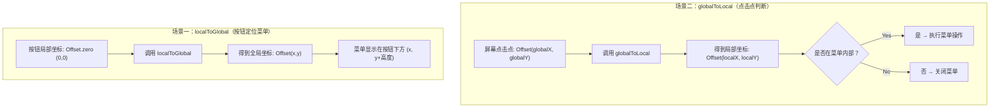
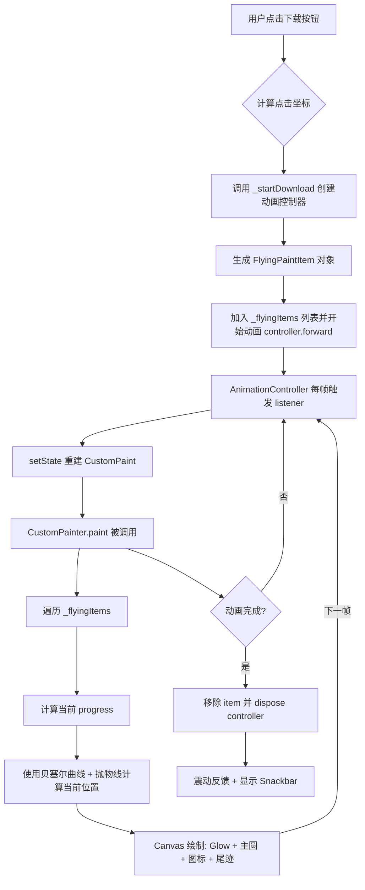

业务需求实现一个飞入动画效果，整体逻辑应该与业务脱耦，要满足全局方便调用且定位

## 📌 设计思路（解耦 + 自适应）

整体可通过自定义视图直接在合理时机渲染或者通过封装动画类由外部传入参数触发

| 对比点       | 自定义视图                 | 封装写法                                |
| ------------ | -------------------------- | --------------------------------------- |
| **耦合度**   | 高（业务里直接写动画逻辑） | 低（业务只调用接口）                    |
| **复用性**   | 差，只能用于打印场景       | 强，可以用于任意 “起点 → 终点” 飞行动画 |
| **适配性**   | 业务层要关心屏幕位置       | 封装类内部统一适配                      |
| **维护性**   | 动画逻辑散落在业务代码里   | 动画逻辑集中在一个类里                  |
| **调试成本** | 低（业务可见，直观）       | 稍高（需要进入封装类排查）              |

## PlanA —— 自定义视图

在项目启动页通过 stack 声明完成动画层叠原有界面布局，尝试完成跨视图动画效果渲染

```dart
return Stack(
  children: [
    const Scaffold(
      appBar: SysHeader(),
      body: AppPages(),
    ),
    ValueListenableBuilder<PrintAnimationState>(
      valueListenable: PrintTaskAnimationController().animationState,
      builder:  (final context, final animationState, final child) {
          return PrintTaskFlyAnimation()
          }))
      ]
    );
```

直接尝试获取起始点坐标后调用视图渲染发现并不能完成完整动画渲染，出现闪烁后立马消失

````dart
    // 直接调用动画控制器
 PrintTaskAnimationController().triggerFlyAnimation(
      startPosition: buttonPosition,
      endPosition: jobsPosition,
      config: const PrintTaskAnimationConfig(
        animationDuration: 1500,
        initialScale: 0.8,
        finalScale: 1.2,
      ),
      onComplete: onComplete,
    );
    
    ```
class PrintTaskFlyAnimation extends StatefulWidget {

return AnimatedBuilder(
  animation: _animationController,
  builder: (final context, final child) {
    ----
 }
````

**问题排查**

通过打断点发现一切传值都符合预期，但是渲染效果很不稳定基本都是闪烁或者无感知，综合分析得出以下结论：

1.  动画 widget 没有独立渲染层，被父 widget rebuild 覆盖
2.  widget 生命周期依赖业务树，父级页面刷新时被销毁
3.  动画控制器提前 dispose

综合来看，通过自定义 View 由于 Flutter 框架机制无法保证稳定动画渲染

## PlanB ——  单例封装

```
业务代码调用
   ↓
FlyAnimationManager（单例）
   ↓
创建 OverlayEntry（飞行动画 Widget）
   ↓
插入到 Overlay 层渲染
   ↓
动画执行完成 → 移除 OverlayEntry

```

### 1. 动画和业务解耦

*   业务层只抛出一个事件：`onTaskAdded(printerId, data)`。
*   UI 层监听这个事件，在界面上启动一段动画（飞入效果）。
*   任务列表本身通过 `Stream`/`Provider`/`Riverpod` 来刷新，不直接依赖动画。

👉 **即：动画只是一个视觉过渡，和业务没关系。**

***

### 2. 相对定位飞入（核心技巧）

在 Flutter 里想要实现「从 A 点飞到 B 点」并且跨 Widget 层级，需要用 **Overlay + Positioned + GlobalKey**。

*   给 **起点（添加按钮）** 和 **终点（任务列表容器）** 各放一个 `GlobalKey`。
*   点击「添加」时，通过 `RenderBox.localToGlobal` 获取起点和终点的坐标。
*   在 `Overlay` 上插入一个临时 Widget，从起点 `Offset` 动画过渡到终点 `Offset`。
*   动画完成后移除临时 Widget，并正式把任务加入列表。

通过 `Key` 获取全局坐标

```dart
final renderBox = myKey.currentContext!.findRenderObject() as RenderBox;

// 组件左上角相对屏幕的位置
Offset globalPosition = renderBox.localToGlobal(Offset.zero);

// 组件右下角相对屏幕的位置
Offset globalBottomRight = renderBox.localToGlobal(renderBox.size.bottomRight(Offset.zero));

```

***

### 3. 适配不同屏幕大小

*   因为起点和终点是通过 **GlobalKey 动态计算的绝对位置**，不依赖固定坐标，所以在任何窗口大小、屏幕分辨率下都能飞入到正确位置。
*   `Overlay` 是全局层，可以覆盖在不同布局之上。

## 坐标定位特性

> 实际使用中，对于 `localToGlobal` 及 `globalToLocal` 有一些不理解，查询后记录如下：

*   **`localToGlobal`** = 把 widget 内部坐标 → 转换到世界坐标（比如你点在 widget 内部的某个位置，要知道它在屏幕上的绝对位置）。
*   **`globalToLocal`** = 把世界坐标 → 转换到 widget 内部（比如你获取到屏幕某个点击点，想知道它在 widget 内部是哪里）。

举例这里，黑色框为显示屏幕，蓝色为软件窗口


| 特性         | `localToGlobal`                                              | `globalToLocal`                                              |
| ------------ | ------------------------------------------------------------ | ------------------------------------------------------------ |
| **方向**     | 将局部坐标（local） → 转换为全局坐标（global / ancestor）    | 将全局坐标（global / ancestor） → 转换为局部坐标（local）    |
| **输入**     | 局部坐标（例如 `Offset.zero` = widget 左上角）               | 全局坐标（例如屏幕点击点）                                   |
| **输出**     | 全局坐标（通常相对于屏幕左上角 (0,0)）                       | 局部坐标（相对于 widget 左上角 (0,0)）                       |
| **用途场景** | - 计算 widget 在屏幕上的位置（弹窗/Tooltip） - 拖拽/吸附边界检测 | - 将点击/手势的屏幕位置转化为 widget 内部坐标 - 绘制局部响应区域 |
| **常见写法** | `renderBox.localToGlobal(Offset.zero)`                       | `renderBox.globalToLocal(globalOffset)`                      |

### 执行差异



> 动态效果


### 进一步拓展

还可以采用 paint 自绘完成下载动效飞入，对于动画控制可实现粒子级控制并且避免破坏 Widget 结构，实现多种复杂运动轨迹、光效等 Flutter 原生组件无法实现的效果；



```dart
  final progress = item.controller.value;
  final curveProgress = Curves.easeInOut.transform(progress);

  // 计算路径位置 + 抛物线高度
  final dx = lerpDouble(item.startPosition.dx, item.endPosition.dx, curveProgress)!;
  final dy = lerpDouble(item.startPosition.dy, item.endPosition.dy, curveProgress)!;
  final controlOffset = -100.0 * math.sin(math.pi * curveProgress);
  final currentPosition = Offset(dx, dy + controlOffset);
```

> 动态效果


Github：<https://github.com/lizy-coding/flutter_study/tree/master/download_animation_demo>