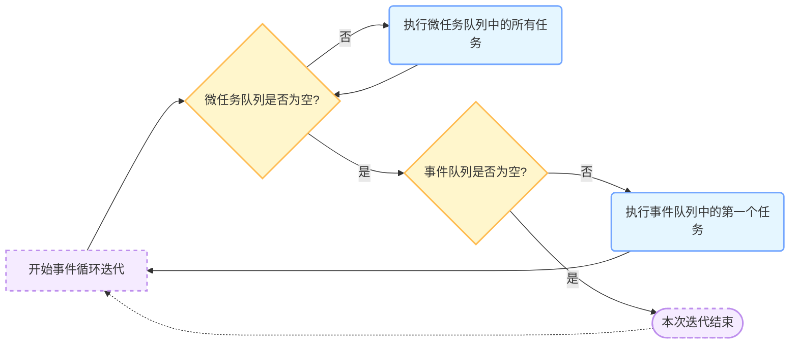

# 气定神闲 —— Flutter Event Loop


## 事件循环（Event Loop）

事件循环是 Dart 语言和 Flutter 框架中处理异步操作的核心机制。通过调度和执行异步任务，确保程序能够高效地响应用户输入、网络请求等异步事件。以下是关于事件循环的详细解释。

### 事件循环的工作原理

事件循环的主要功能是管理和调度两个队列中的任务：`事件队列（Event Queue）`和`微任务队列（Microtask Queue）`。运行过程将按照一定的顺序处理这些任务，保证程序的顺利运行。

1. **事件队列（Event Queue）**：
   - 存放异步事件，如用户输入、网络请求、定时器回调等。
   - 这些事件在异步操作完成后被添加到事件队列中。

2. **微任务队列（Microtask Queue）**：
   - 存放优先级较高的微任务，如 `Future.microtask` 调度的任务和 `scheduleMicrotask` 调度的任务。
   - 微任务会在事件循环的每次迭代中优先处理。
   
   

| 对比维度   | 事件队列                                                     | 微任务队列                                                   |
| ---------- | ------------------------------------------------------------ | ------------------------------------------------------------ |
| 任务来源   | 来自异步操作回调，如浏览器中`setTimeout`、`setInterval`、DOM事件（鼠标点击、键盘输入等），Node.js中的文件读写、网络请求等异步I/O操作完成后的回调函数 | 来自JavaScript语言本身异步操作，如`Promise`的`.then()`、`.catch()`、`.finally()`方法回调，`async/await`相关回调，`MutationObserver`回调函数 |
| 执行时机   | 调用栈为空且微任务队列所有任务执行完毕后执行                 | 每次事件循环迭代开始，先检查并执行微任务队列所有任务，直到队列为空，才处理事件队列任务 |
| 执行顺序   | 先进先出（FIFO）                                             | 先进先出（FIFO），且优先于事件队列执行                       |
| 用途和场景 | 处理相对耗时、不紧急的异步操作，如网络请求、文件读写，避免阻塞主线程 | 用于当前任务完成后需尽快执行的操作，如更新UI状态、处理依赖异步操作结果的后续逻辑 |

### 事件循环的执行顺序


事件循环的每次迭代遵循以下顺序：

1. **执行微任务队列中的所有任务**：
   - 微任务队列中的任务优先执行，并且会一直执行直到队列为空；在每一次事件循环中，Dart总是先去第一个微任务队列中查询是否有可执行的任务，如果没有，才会处理后续的事件队列的流程；

2. **执行事件队列中的第一个任务**：
   - 处理完所有微任务后，事件循环会从事件队列中取出第一个任务并执行；

3. **重复以上步骤**：
   - 事件循环会不断重复上述步骤，确保所有任务都能够得到处理。


### Event Loop



### 示例

下面是一个简单的示例，展示了事件循环如何处理微任务和事件任务。

```dart
import 'dart:async';

void main() {
  print('Start');

  // 添加一个事件任务到事件队列
  Timer(Duration(seconds: 1), () {
    print('Event: Timer 1');
  });

  // 添加一个微任务到微任务队列
  scheduleMicrotask(() {
    print('Microtask 1');
  });

  // 添加另一个事件任务到事件队列
  Timer(Duration(seconds: 1), () {
    print('Event: Timer 2');
  });

  // 添加另一个微任务到微任务队列
  scheduleMicrotask(() {
    print('Microtask 2');
  });

  print('End');
}
```

输出结果：
```
Start
End
Microtask 1
Microtask 2
Event: Timer 1
Event: Timer 2
```

解释：

1. `print('Start')` 和 `print('End')` 是同步任务，首先执行。
2. 两个微任务 `Microtask 1` 和 `Microtask 2` 被添加到微任务队列中，并在同步任务完成后立即执行。
3. 两个事件任务 `Timer 1` 和 `Timer 2` 被添加到事件队列中，并在微任务完成后依次执行。

-   **同步任务**：这些任务直接执行，不经过事件循环的队列。

-   **微任务**：微任务被添加到微任务队列后，会在当前事件循环迭代中尽快执行，优先于事件队列中的任务。

-   **事件任务**：当微任务队列为空时，事件队列中的任务（如定时器回调）才会被处理。

### 事件循环在 Flutter 中的应用

在 Flutter 中，事件循环在处理各种异步操作（如用户输入、动画、网络请求等）时起着关键作用。理解事件循环的工作原理，可以更好地编写高效的异步代码，避免常见性能问题。

例如，在 Flutter 中使用 `Future` 和 `Stream` 来处理异步数据时，可以通过合理使用微任务和事件任务，确保 UI 更新及时，提升用户体验。

```dart
void main() async {
  print('Start');

  // 使用 Future.microtask 调度微任务
  Future.microtask(() {
    print('Microtask');
  });

  // 使用 Future.delayed 调度事件任务
  Future.delayed(Duration(seconds: 1), () {
    print('Event: Future.delayed');
  });

  print('End');
}
```

输出结果：

```dart
Start
End
Microtask
Event: Future.delayed
```

  - 事件循环通过微任务和事件队列的分离，确保了任务的优先级和顺序处理。微任务先于事件任务执行，确保了关键任务的即时响应。
  - 理解事件循环的机制有助于开发者编写更加高效、响应迅速的 Flutter 应用程序。通过合理调度微任务和事件任务，可以避免阻塞 UI 线程，提升应用性能和用户体验。