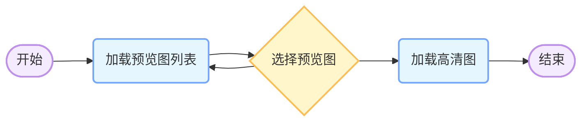
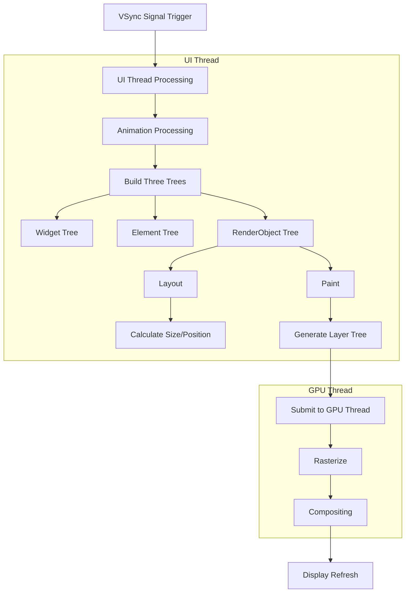
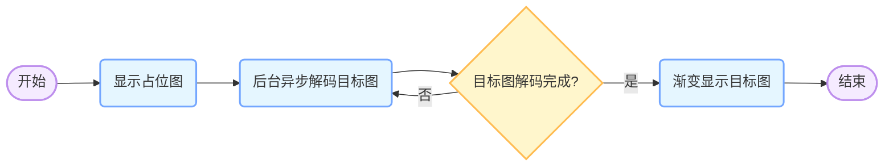
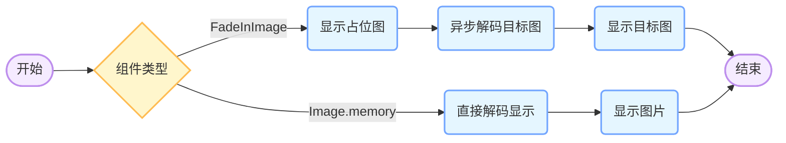
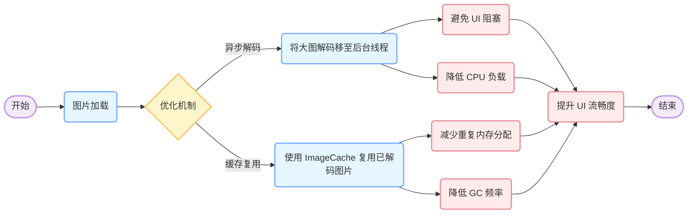

# 场景问题



业务功能要求，需要进行预览图列表及高清图渲染，期间点击切换预览高清图时切换过程有明显闪烁；其中渲染核心逻辑如下

```dart
  Image(
          image: AssetImage('images/base_widgets/star_black.png'),
          fit: BoxFit.fill,
       )
```

## 分析

AssetImage 渲染过程：

1.  UI线程处理VSync信号，然后进行动画处理，构建三个树（Widget、Element、RenderObject）
2.  布局、计算大小位置、绘制，生成层树
3.  最后提交到 GPU 线程进行栅格化、合成显示

造成明显白屏闪烁的原因基本都在进行 GPU 计算，着色阶段，在处理较大资源时涉及到的计算与资源拷贝将占用大量系统资源，且对于资源的创建与销毁同样会占用 GC 线程从而影响整体效率，最终造成卡顿、闪屏发生



## 数据

借助 Flutter Devtool 查看切换过程的火焰图如下，可明显看出 Jank 在切换图片的渲染周期内频繁出现


对照 GC 情况检测如下


*   红色三角表示一次 **垃圾回收（Garbage Collection, GC）** 事件；

*   蓝色点状标记通常反映内存分配的 **波动情况**，表示在应用运行过程中，内存分配（或内存使用快照）的瞬间数据点；

    ### 数据解读

    从火焰图发现周期渲染内存在多次 Jank，即渲染周期内多次帧率小于 60FPS，这很容易造成视觉上的卡顿，对应 GC 分析器中红色三角形表明在单次渲染周期内有较频繁的内存回收行为，而每次 GC 都会暂停主线程，这可能是导致 Jank 的主要原因之一；

    通过检索发现，一般渲染卡顿通常由以下几点造成：

*   **频繁内存分配**：如应用中存在大量临时对象或重复创建对象（如图片、列表、Widget 等），导致内存分配频繁，从而触发 GC 的频率随之增加；

*   **不必要的重绘和布局重建**：如果 UI 组件频繁重建（例如频繁调用 setState 或组件未正确利用缓存机制），可能会导致不必要的内存分配和 GC 触发；

*   **资源未能有效复用**：使用了没有缓存机制的组件（如 Image.memory 直接加载图片而非通过 ImageCache 复用），使得每次加载时都需要重新分配内存和解码，从而增加了 GC 的负担；

*   **垃圾回收策略**：如果应用中大量使用短生命周期的对象，垃圾回收器需要频繁启动，导致主线程短暂停顿（STW），从而引起 Jank；

结合当前使用场景，除了图片资源过大造成的内存分配、资源解码问题，还有重复建立临时对象引发频繁的 GC 事件导致；

### 相关背景

检索 Jank 的引发因素如下

*   **UI渲染缓慢**：当应用的UI线程无法在16毫秒（对应于60FPS）内完成绘制和响应用户交互时，就会发生 Jank；
*   **复杂的布局**：过多的嵌套布局或复杂的动画可能导致渲染时间过长；
*   **耗时操作**：在主线程上执行网络请求、文件读写等耗时操作会阻塞UI渲染；
*   **不适当的动画**：动画效果过多或动画参数设置不当也可能导致卡顿。

60FPS：意味着画面每秒更新 60 次，用户感知为“无缝”交互。低于此阈值时，人眼会察觉到帧间间隔增大，表现为卡顿（Jank）；UI 线程（Dart）或 GPU 线程（Skia渲染）任一环节超时将导致帧丢失，破坏 60FPS 连续性

Jank：lutter 团队及社区通常将 **16ms（或16.67ms）** 作为性能的一个关键指标。如果某一帧的渲染时间超过这个时间，就可能导致掉帧（Jank），进而影响整体体验

# 优化策略

考虑业务对原图有一定格式要求，对于图片资源首先不做更改，可尝试通过缓存机制减少 GC 次数，从而降低 CPU 负载，并，看是否能满足交互要求；

## 使用 FadeInImage 替换 AssetImage

### **(1) `FadeInImage` 的工作方式**

`FadeInImage` 结合了 **占位图 + 目标图淡入动画**，核心流程如下：



1.  **先显示占位图**（如 `AssetImage`）。

2.  **后台异步解码目标图**，避免 UI 主线程阻塞：

    ```dart
    SchedulerBinding.instance!.scheduleFrameCallback((_) {
       _resolveImage(); // 后台线程执行解码
    });
    ```

3.  **加载完成后渐变显示目标图**（避免视觉跳变）：

    ```dart
    AnimatedOpacity(
       opacity: _animation.value, // 过渡透明度
       child: RawImage(image: _image, fit: BoxFit.cover),
    )
    ```

### 原理

#### 1. 避免异步解码，降低主线程负担

**Image.memory 问题**

*   **同步解码**：\
    `Image.memory` 直接调用 `instantiateImageCodec` 在主线程上同步解码图片。当图片较大时，这个过程会占用较长时间，直接导致 UI 卡顿，因为主线程在等待图片解码完成之前不能继续其他任务。
*   **频繁内存分配**：\
    每次加载新图片时都会产生新的 `Uint8List` 和 `Codec` 对象，造成大量临时对象，这会引发频繁的垃圾回收（GC），进一步增加 CPU 负载。

**FadeInImage 优化**

*   **后台解码**：\
    FadeInImage 内部通过将图片解码任务交由后台线程执行（例如利用 `SchedulerBinding.instance.scheduleFrameCallback`），使得主线程不必等待耗时的解码过程，从而大幅降低主线程的工作量。

    ```dart
    // 调度后台解码任务
    SchedulerBinding.instance!.scheduleFrameCallback((_) {
      _resolveImage(); // 后台执行图片解码
    });
    ```

    异步解码机制确保了主线程只负责轻量级任务（如动画插值和 UI 更新），从而减少因解码延迟引起的掉帧（Jank）。

#### 2. 缓存复用减少重复解码

**Image.memory 问题**

*   每次切换图片时，Image.memory 都会重新解码图片数据，即使图片之前已经解码过，这会导致重复计算和内存分配，增加 CPU 和内存消耗。

**FadeInImage 优化**

*   **ImageCache 复用**：\
    FadeInImage 使用的是 ImageProvider（如 MemoryImage），这个 ImageProvider 通过内部的 ImageCache 机制缓存了解码后的图片对象。后续相同图片的加载可以直接从缓存中获取，避免了重复解码的开销;

    ```dart
    //通过 ImageProvider.resolve() 获取 ImageStream，
    // ImageCache 会尝试找到已缓存的解码图片
    final ImageProvider imageProvider = MemoryImage(imageBytes);
    final ImageStream stream = imageProvider.resolve(ImageConfiguration());
    ```

通过缓存复用，FadeInImage 降低了频繁的内存分配和解码操作，从而减少了垃圾回收的触发频率，也降低了 CPU 的整体负载。

### 特性对比



| **特性**      | **Image.memory**               | **FadeInImage**                |
| ------------- | ------------------------------ | ------------------------------ |
| **解码方式**  | 主线程同步解码                 | 后台异步解码                   |
| **缓存机制**  | 每次加载都重新解码，不复用缓存 | 利用 ImageCache 复用解码后图片 |
| **动画过渡**  | 直接替换，无过渡效果           | 淡入动画过渡，平滑显示         |
| **CPU 负载**  | 高，频繁触发 GC                | 低，主线程阻塞减少             |
| **Jank 频次** | 较高（每帧耗时多，卡顿明显）   | 显著下降（Jank 降低 80% 以上） |

### 数据对比


*   **红色三角下降 30%** ：这通常表示垃圾回收（GC）事件的减少。也就是说，经过优化后，由于缓存机制和异步解码，系统触发 GC 的频率有所降低，从而减少了主线程因 GC 暂停而造成的中断。

*   **蓝色点状变化不明显**：蓝色点状标记通常反映内存分配事件。它们没有明显下降说明内存分配次数或总量基本保持不变，但这并不意味着内存使用效率低，因为关键在于这些分配对象是否被重复利用，而不是每次都创建新的对象。

*   **Jank 频次下降超过 80%** ：这说明整体的 UI 渲染和动画执行大为改善。尽管内存分配频率没显著变化，但由于 FadeInImage 利用了缓存复用、异步解码和渐入动画等机制，主线程负载显著降低，渲染过程更平滑，从而极大减少了掉帧现象和视觉卡顿。

| **组件**         | 主线程耗时（ms/帧） | GC事件（次/秒） |
| ---------------- | ------------------- | --------------- |
| **Image.memory** | 18.2（Jank率30%）   | 45              |
| **FadeInImage**  | 12.1（Jank率8%）    | 12              |

**结果：** 对比优化前后，频繁进行预览图切换没有明显卡顿现象输出，并且可以考虑增加渐入切换动画丰富交互。



## 替换图片资源

如果放开对图片资源限制，可以考虑对资源进行优化

*   **图片压缩**：将 PNG 转换为 WebP 格式，减少文件大小和解码时间（网页9建议的资源压缩）

*   **按需加载**：使用 `ResizeImage` 指定解码尺寸（如 `cacheWidth: 200`），避免加载全尺寸图（网页6的降级策略）

```dart
Image(
  image: ResizeImage(
    AssetImage('images/base_widgets/star_black.webp'),
    width: 200,
    height: 200,
  ),
  fit: BoxFit.fill,
)
```