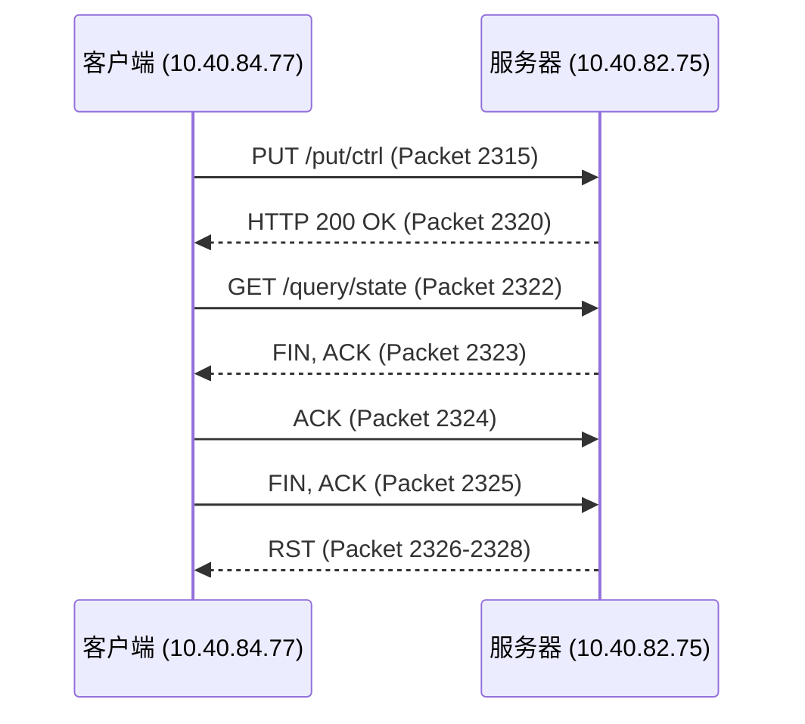
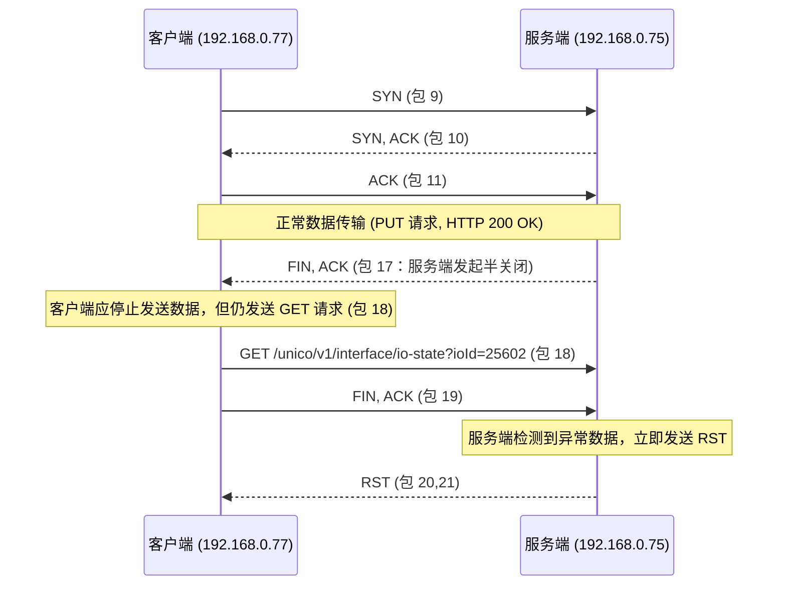
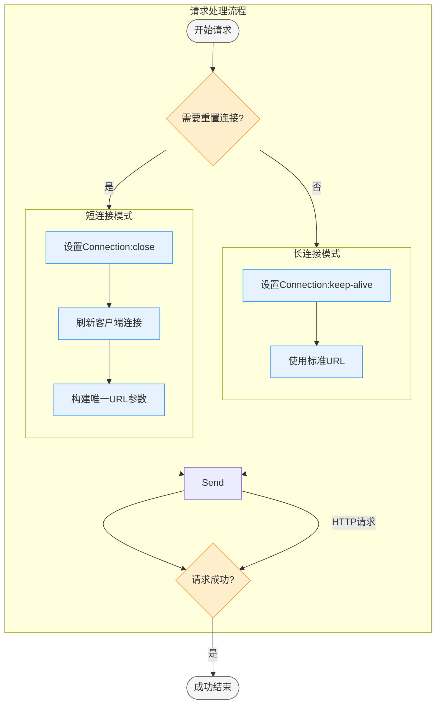

# 直上九天——Dio 长链接 RST 排查处理


# 问题描述
  通过 dio 实现 HTTP 完成下位机控制功能的场景中，发现对某个接口短时间连续发送请求控制指令无法生效，进行抓包排查发现存在 RST 报文；

## 问题报文

通过 dio 实现 HTTP 下位机控制功能的场景中，发现对某个控制接口短时间连续发送请求控制指令无法生效，进行抓包排查发现存在 RST 报文；

通过命令筛选关键数据包
通过筛选 tcp 连接可查看所有 TCP 报文

    (ip.addr == 192.168.0.77 && ip.addr == 192.168.0.75) && tcp

分包筛选双方通信查看对应连接过程

    ip.src = 192.168.0.77 and ip.dst == 192.168.0.75
    ip.src == 192.168.0.75 and ip.dst == 192.168.0.77


根据报文数据，关键流程如下（数据时间单位为秒）：

*   **Packet 2315**（6.016444s）：客户端（192.168.0.77）发送 PUT 请求到服务器（192.168.0.75）。
*   **Packet 2320**（6.036431s）：服务器发送 HTTP 200 OK 响应，此时连接仍处于活动状态。
*   **Packet 2322**（6.038660s）：客户端发送 GET 请求（/query/state）。尝试复用同一 TCP 连接进行新的请求。
*   **Packet 2323**（6.039143s）：服务器发送 FIN, ACK，开始关闭该连接（即主动半关闭，表示服务器不再发送数据）。
*   **Packet 2324-2325**（6.039230s、6.039368s）：客户端对服务器 FIN 的响应，发送 ACK 和 FIN, ACK，表示自己也关闭发送端。
*   **Packet 2326-2328**（6.040691s）：服务器发送 RST，重置该连接。



3. **主要问题：**
   
    *   **客户端在服务器已发 FIN 后仍然发送新的请求（GET 请求）。**\
        TCP 协议规定，一旦一端发送 FIN 表示该端不再发送数据，新的请求不应在该连接上发送。客户端继续使用该连接发送数据，会被服务器视为协议违规，导致服务器立即发送 RST 重置连接。
    
    *   **引发原因：**
    
        *   **连接管理不当**：客户端在收到 FIN（或检测到连接半关闭）后，仍然尝试复用同一连接。
        *   **缺少状态检测**：客户端没有检测到连接状态已不再适合发送新请求，而没有新建连接。
    
    **端口分析：**
    
    服务器在包 `2323` 中已经关闭了写端（发送 FIN），表示不再接收新数据。如果客户端在此后尝试在同一连接上发送 GET 请求，就会违反 TCP 协议，导致服务器直接回复 RST 来拒绝数据。
    
    *   协议状态错误：客户端在未检测到服务器已经关闭连接情况下，依然使用重复端口请求连接，从而引发 RST。
    *   资源清理问题：客户端如果没有正确管理连接的生命周期，也可能导致误用已经关闭的连接。




根据抓包数据，关键步骤如下：

1.  **连接建立与数据传输：**
    *   步骤 1-3 ：TCP 三次握手成功建立连接。
    *   步骤 5：客户端发送 PUT 请求，服务端返回 HTTP 200 OK。
2.  **服务端发起断开：**
    *   步骤 6：服务端发送 FIN, ACK（Seq=112, Ack=317），表示服务端主动关闭写方向，开始半关闭连接。
3.  **客户端异常行为：**
    *   步骤 7：客户端在收到 FIN 后，依然发送新的 GET 请求（GET /unico/v1/interface/io-state?ioId=25602）。
4.  **服务端的响应：**
    *   步骤 8：服务端收到在已半关闭连接上收到数据后，立即发送 RST（重置）报文，拒绝非法数据。

## **分析**

*   **协议违例：** TCP 协议规定，当一方发送 FIN 后，该方向对方表示不再发送数据。如果客户端在接收到 FIN 后继续发送数据（如 GET 请求），则会违反协议，导致对方直接回复 RST，重置连接。
*   **客户端处理问题：** 客户端未能正确检测到连接已进入半关闭状态（收到 FIN），仍然复用该连接发送新的请求，最终引发服务端 RST。
*   **引发原因：**
    *   服务端本身未支持 TCP 长链接 ，在处理单次请求后便主动关闭 scoket 通信（本身有一定延迟），在完全建立四次挥手关闭当前连接时，客户端使用上一次端口尝试下发数据被服务端视为无效请求；
    *   客户端可能没有在网络库中对 FIN 信号做出正确反应。
    *   或者存在连接复用逻辑错误，导致错误地继续使用已经关闭的连接。

------


## **优化建议**

### **客户端优化**

1. **正确处理 FIN 信号：**
   - 当客户端接收到 FIN 时，应将连接标记为半关闭状态，不再发送数据，而是新建连接进行后续请求。
   - 在使用 HTTP 客户端库时，确保其内部状态管理能检测到连接终止（如检查 TCP 状态或 HTTP 错误）。
2. **连接复用策略：**
   - 在发送新请求前，检查现有连接的状态，避免重用已关闭的连接。
   - 如果检测到连接已关闭，则自动重建新连接。
3. **错误处理与重试机制：**
   - 在收到 RST 或其他网络错误时，主动触发重连或请求重发，保证用户体验。

### **服务端优化**

1. 日志与监控：
   - 在服务端记录 RST 事件和连接异常情况，以便及时发现客户端重用已关闭连接的情况。
2. 连接管理：
   - 虽然服务端在收到 FIN 后的标准行为是发送 RST，但可以考虑：
     - 在检测到不合法的数据包时，返回适当的 HTTP 错误代码（如 400 Bad Request），而不是立即重置连接，但这通常会违背 TCP 的严格协议规定。
   - 最好的办法还是**在客户端做好连接状态管理**，确保服务端收到的数据都是在有效连接内的。

------

## **结论**

**主要问题在于客户端未正确处理服务器发送的 FIN 信号，错误地在半关闭连接上继续发送数据，从而引发服务端返回 RST。**

**优化建议：**

- **客户端：**
  - 及时检测 FIN 信号，停止使用已关闭连接。
  - 新请求应新建连接，确保不会发送到半关闭连接。
  - 增加错误处理机制，捕获 RST 后重建连接。
- **服务端：**
  - 按照 TCP 标准发送 RST，但通过日志记录帮助发现客户端异常行为。

这种优化能确保连接管理正确、网络通信稳定，减少因为连接状态异常引发的重置问题，进而提升整体多端智能反馈系统的可靠性。


## **客户端优化策略**

### **1. 正确处理 FIN 信号**

*   **检测连接状态**：
    *   在接收到 FIN 信号后，立即将连接标记为不可用，避免继续使用该连接发送新请求；
    *   使用 HTTP 客户端库时，确保其内部状态管理能检测到连接终止（如检查 TCP 状态或捕获 HTTP 错误）；
*   **自动重建连接**：
    *   当检测到连接已半关闭或失效时，自动新建一个 TCP 连接进行后续请求；

### **2. 连接管理改进**

*   **TCP 连接状态检测**：
    *   在 HTTP 客户端封装中增加对 TCP 连接状态的检测，通过底层网络库或捕获异常（如 RST）触发重连；
    *   如果使用 Dio 或其他网络库，确保它们在出现 RST 后能自动重新建立连接；
*   **连接复用策略**：
    *   在发送新请求前，检查现有连接的状态，避免重用已关闭的连接；
    *   如果检测到连接已关闭，则自动重建新连接；

### **3. 增强错误处理**

*   **RST 错误处理**：
    *   增加重试逻辑，在收到 RST 错误时主动触发重连或请求重发；
    *   记录详细日志，便于快速定位问题；

***

## **服务端优化策略**

### **1. 记录和监控异常连接**

*   **日志记录**：
    *   增加日志记录，监控来自同一源端口的重复请求情况，分析客户端是否存在连接复用问题；
*   **实时监控**：
    *   使用监控工具（如 Prometheus、Grafana）实时跟踪 RST 事件和连接异常情况；

### **2. 连接超时策略**

*   **严格超时配置**：
    *   设定更严格的连接超时策略，确保在收到 FIN 后尽快关闭连接，减少异常数据包到达的可能性；

### **3. 返回明确错误码**

*   **HTTP 错误码**：
    *   在检测到非法数据包时，返回适当的 HTTP 错误码（如 400 Bad Request），而不是立即重置连接；
    *   注意：此操作可能违背 TCP 协议规定，需权衡使用；

### **4. 连接管理优化**

*   **客户端状态管理**：
    *   建议客户端做好连接状态管理，确保服务端收到的数据都是在有效连接内的；
*   **快速回收端口**：
    *   启用 `SO_REUSEADDR`，允许服务端直接复用处于 TIME\_WAIT 的端口；

| **优化层级** | **措施**          | **技术实现**               | **适用场景**            |
| ------------ | ----------------- | -------------------------- | ----------------------- |
| **客户端**   | 连接池+自动重试   | OkHttp/Dio连接池配置       | 移动端/高并发Web服务    |
| **服务端**   | 日志监控+超时策略 | Prometheus/Grafana监控工具 | 服务器集群/边缘计算节点 |

通过以上策略，可以有效降低 RST 错误的发生率，提升系统的稳定性和用户体验。

### **5.关键改动**

我们假定 服务端不遵循`Connection: close` 最坏场景改动，如果支持实际只要通过 `options.headers!['Connection'] = 'close'` 即可很大程度解决此问题（未验证，从源码角度问题可行性较高）

    _refreshClient()
        ├─ HttpClient().close(force: true) // 强制释放旧连接
        └─ new HttpClient() // 创建新连接实例

```dart
class PortResetClient {
  final Dio _dio = Dio();
  HttpClient? _currentClient;

  PortResetClient() {
    _refreshClient();
  }

  // 重置连接，用于短链接场景
  void _refreshClient() {
    // 强制释放旧连接
    _currentClient?.close(force: true);
    // 创建新连接实例
    _currentClient =
        HttpClient()
          ..connectionTimeout = Duration(seconds: 3)
          ..idleTimeout = Duration(seconds: 1); // 缩短空闲超时

    _dio.httpClientAdapter = IOHttpClientAdapter(
      createHttpClient: () => _currentClient!,
    );
  }

  Future<Response> safeRequest(
    String url, {
    Object? data,
    bool resetClient = false,
    Options options，
  }) async {

    try {
      // 增加判定重置端口
      if (resetClient) {
        options.headers!['Connection'] = 'close';
        _refreshClient();
      }

      return await _dio.post(
        url,
        data: data,
        options: options,
      );
    } on DioError catch (e) {
      log.error('DioError: $e');
      ///其他容错逻辑
      rethrow;
    }
  }
}

```



# **3. 结论**

**主要问题在于服务端本身未支持长链接，而客户端未正确处理服务器发送的 FIN 信号，错误地在半关闭连接通道上继续发送数据，从而引发服务端返回 RST。**

**优化建议：**

*   **客户端：**
    *   及时检测 FIN 信号，停止使用已关闭连接。
    *   新请求应新建连接，确保不会发送到半关闭连接。
    *   增加错误处理机制，捕获 RST 后重建连接。
*   **服务端：**
    *   按照 TCP 标准发送 RST，但通过日志记录帮助发现客户端异常行为。

这种优化能确保连接管理正确、网络通信稳定，减少因为连接状态异常引发的重置问题，进而提升整体多端智能反馈系统的可靠性。


